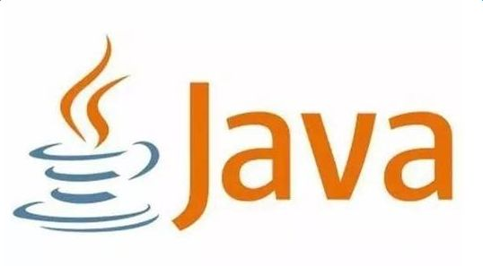

本文以java为主要语言介绍面向对象相关概念

## 面向对象Java基础

- 类

- 属性

- 方法


## 类：

白话解释：是计算机科学家抽象(提炼)出来的一种计算机概念，将现实世界的事物用数据的形式进行描述/表示的一种方法。

比如：人们把圆形，具有绿、黑相间条纹、夏天在地上生长出来的，内瓤红色一种植物称作西瓜（虽然后来也有了黄瓤、白瓤瓜，但总体共性是一样的）

形式：用数据类型(字符串，数字，二进制文件等)来描述一个事物

这样就可以根据这种计算机表示方法和西瓜的特点写出一个类

```java
public class WaterMelon{
    String shape = "round";//字符串(文本、文字)来描述特点
    String appearanceColor = "green & black"
    String growingEnvironment = "soil";
    String fleshColor = "red";    
    String season = "summer";
    double weight = 5.01;//单位：kg 用数字来表示重量
}
```

## 属性：

上面的 

- shape  形状

- appearanceColor 外观颜色

- growingEnvironment 成长环境

- fleshColor 瓜瓤颜色

- season 成长季节

- weight 重量 

  这些都是类的属性，也就是抽取出来的西瓜的共性（只记录代码中需要的部分特点，至于“味道”或者其它特点，计算机用不到，不写也罢，不要求穷尽列出，不然代码就没法写了）


## 方法

在面向过程编程中，方法也叫做函数( **function** )，可以跟高中数学的函数作对比，比较类似

高中的函数表示方法为：y = f(x) 。可以百度百科看[概念](https://baike.baidu.com/item/%E5%87%BD%E6%95%B0/301912?fr=aladdin)

高中的函数和代码里面的函数类似，只不过高中的函数大多数是一元函数  ，“一元”就是指 这里的 x 个数只有一个。

面向过程代码中函数的 “元” 的个数可以是 0-n 个，

这里的x 就是函数的参数(入参)

y 就是函数的出参 

f 表示函数名，也就是数学中所说的x和y的映射关系


现在用一些计算机的例子强化一下理解：

假设有这么一段代码

```java
int plus(int x,int y){
    return x + y;
}
```


 


# 面向对象

- 封装
- 继承
- 多态

## 封装

通过```private```关键字或利用函数(方法)作用域对代码特定功能进行包装，并限制外部对其进行修改

## 继承


## 多态


