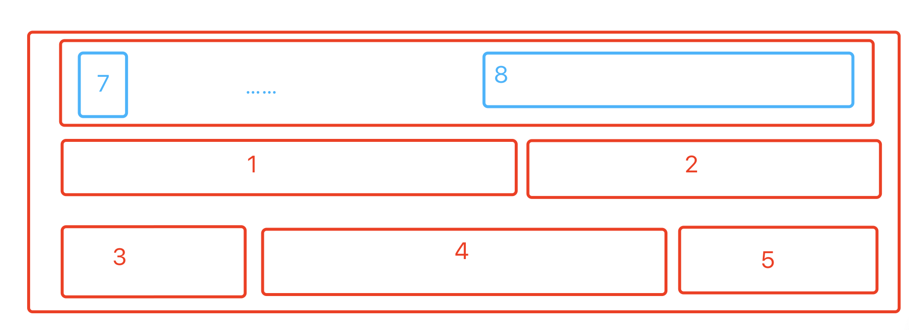
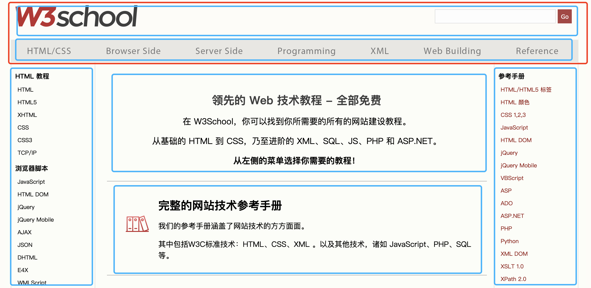
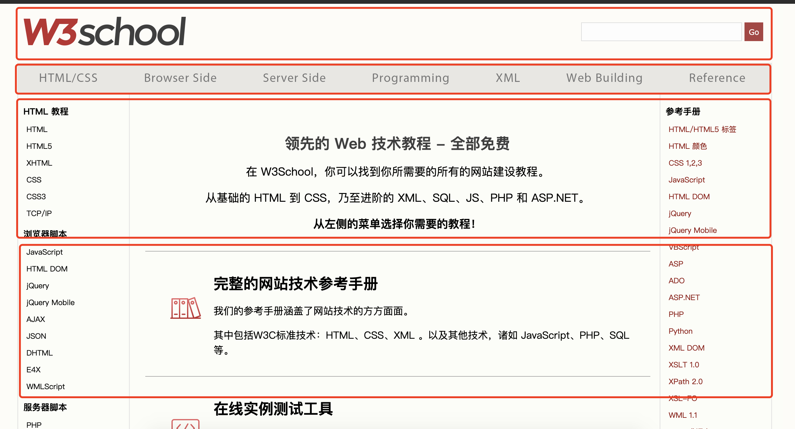
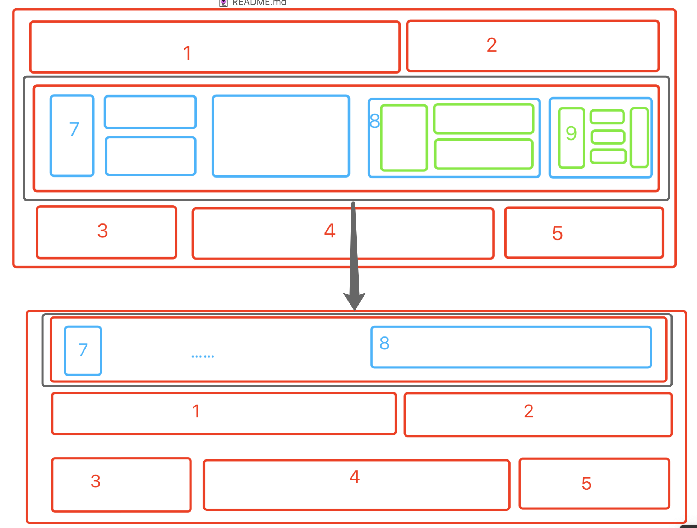
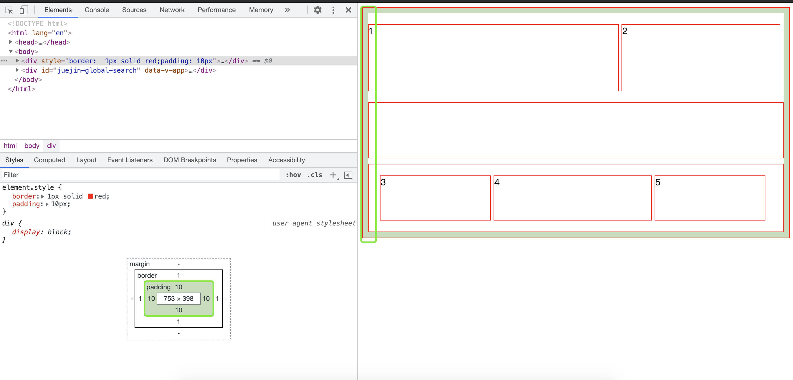
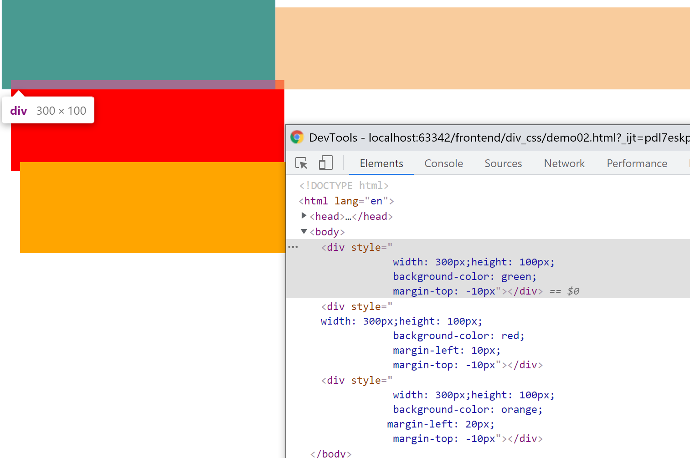
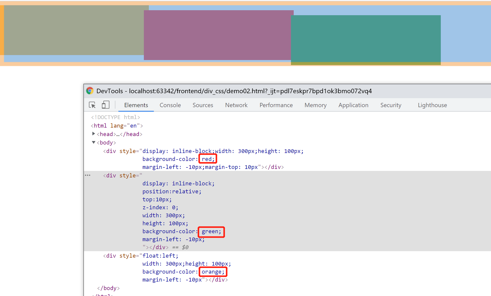
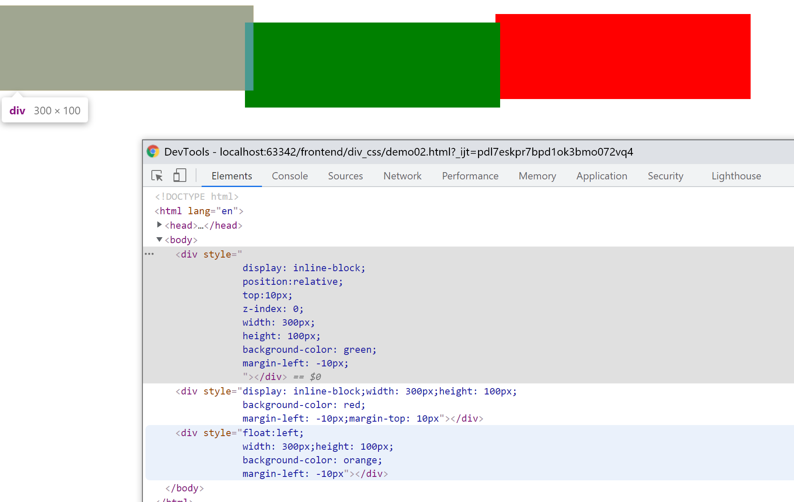

# 前端布局笔记

## 常见布局方式：

https://blog.csdn.net/zhang79513/article/details/102666861

1. 静态布局
2. 弹性布局（flexbox）
3. 自适应布局（bootstrap）
4. 流式布局（fluid）
5. 响应式布局
6. 浮动布局
7. 定位布局

其中PC常用的以静态布局为主，可和混合浮动布局定位布局综合使用。

弹性布局、自适应布局、流式布局、响应式布局常用于移动端适应不同尺寸的移动设备

### 常用布局属性：
本文主要介绍PC常用的布局方式，涉及的css属性如下：

外边距：margin （含 margin-left margin-top margin-right margin-bottom）

内边距：padding ( padding-left padding top padding-right padding-bottom)

display : 块元素（block）；行内块元素（ inline-block）；行内元素（ inline ）

position ：静态（static ）相对位置（relative）绝对位置（absolute）固定位置（fixed）

left top right bottom

浮动（float）：left right

!important : `width:100px !important`

## 基础认识：

说到css布局肯定要提一下『盒模型』，所谓盒模型可以理解为：

页面元素都是一个个大小不一的盒子，大盒子套小盒子；

大盒子中可以放下一行或者多行小盒子。

大盒子中每一行盒子内部还可以放更小的盒子，(方形套娃🐶)

这里的盒子不要完全理解成生活中的盒子，因为生活中的盒子都是有厚度的，css的盒子可以厚度为0( border = 0 )

有了盒模型的概念，元素间便有了父parent / 子children /兄弟 (前一个prev，后一个 next)

上图的布局结构可看成：

**最外面红色**：理解成浏览器窗口，就是window，里面有各种各样元素。

**第一行**：有1 2 两个红色大框

**第二行**：有一个红色大框，里面有蓝色 绿色小框 7 8 9 等等

**第三行**：有三个红色大框 3 4 5

第二行的红色框其实可以不用，但是如果里面蓝色绿色是一个大的整体，那么最好是套一层，以便于后面统一移动比如变成下面这样

这样只要移动一下原来第二行的大框，所有的小元素就 可以很简单地移动到1 2的上方。

说到这里就需要提一下文档布局地规划：

虽然css地盒模型可以随意嵌套， 比如"田" 字 布局可以设计成左右两个"日"  也可以设计成 上下两个横过来的"日"，

但是如果页面结构根据我们习惯 一看就是左右结构，那么你肯定不能设计为上下结构布局，

万一需要调整，那么你的上下结构就会很难分割或者太过零散导致修改工作量巨大。

比如下面的w3c网站，看上去多半是我下面画的这种布局方式。

下面这种规划肯定也是可以的

上面这两种基本是把文档分成了 头部(logo + 搜索)

一级导航：灰色的 html css browser sige ...

二级导航： 左侧菜单

内容：xxxx

三级导航(快速导航): 参考手册

这样一看，内容就各自放在一个大盒子里，如果你非要下面这样规划，看看会不会觉得奇怪？

上面这个布局硬生生把二级导航的"html 教程"和 "浏览器脚本" 分成了凉快，参考手册也变成了上下两块，这样显然不符合我们正常理解的文档结构，不是说不可以，但是这会不会很奇怪？

万一二级导航哪天变成了横向的，放在一级导航下面，不就不好改了嘛，是不是？

**所以：**盒模型第一步是按照页面布局，把文档划分为合理的文档结构，头部，导航菜单，左侧，右侧，内容等等 各自在一个盒子里，盒子里面可以一层，也可以根据内容嵌套多层盒子，所有的盒子都是为了把内容合理地划分归类，便于整体修改和移动。

## 外边距 margin

外边距主要用于移动元素本身，可以理解为修改该元素在父元素中地位置，这个操作会移动元素的同时，会统一移动元素内部的所有子元素。

(有的元素可以通过css属性脱离父元素，这个后面会说)

比如上面的例子，我们把黑色框里面的大红框移到了第一行，那么里面所有小元素就都到了上面一行。

通过浏览器检查元素也可以看见，当选中最大的红框时，将鼠标箭头移动到调试框(左下)的margin部分，会在页面元素(右边)看到同样橙色的边框，修改红框的`margin:20px ` 中的值，便可以看到大红框内部的所有元素都跟着移动了。随着20增大 边距变大，20缩小，边距变小

**所以：**margin是移动元素(修改元素本身所在的位置)，以父元素为参考，调整它在父元素中的位置。

并且该属性会让后面的兄弟节点跟着移动（挤掉兄弟节点的空间 / 让出空间给兄弟节点)。

如果元素往右移动，那么它后面的兄弟也被挤到右边，不够的话，兄弟会换行。

如果子元素在调整margin后margin+width超过父元素宽度，则子元素会以左上为基准，向右/上移动，右/上多出部分则显示在边框外

margin有多种，其中margin-left margin-top margin-right margin-bottom 可单独调整该方向边距。

margin属性还可以分别通过1/2/3/4个参数分别设置外边距属性(但注意部分浏览器如IE9以下，不支持该混合属性)：

- 当1参数时，设置上下左右的外边距。如：`margin:10px` 则表示该元素上下左右均为10px的外边距；
- 当2参数，第一参数为**上下**，第二参数为**左右**。如`margin: 10px 20px`表示该元素上下外边距分别为10px，左右外边距分别为20px；
- 当3参数时，第一参数为上，第二参数为左右，第三参数为下。如：`margin:10px 20px 30px`表示上边距10px ，左右分别20px，下边距30px
- 当4参数时，第 1 2 3 4 参数依次为上、右、下、左四边距的距离。如`margin:10px 20px 30px 40px`表示

**常见用法：** `margin:0 auto;`常用于设置元素居中，表示上下0像素，左右自动(平分)。这里的0也可以根据实际需要调整，上下边距。0作为数值时，可以不用`px` `%` `em` 等单位（反正都是0，管它什么单位呢~）

## 内边距 padding

内边距即元素内部留有的边距，如下图，最外层红色框设置了内边距为10px，则内部元素统一地与为父元素间留下了10px的距离(绿色部分)

调整元素padding时，会使得该元素内部的子元素统一向中心靠拢，与该元素的边框之间留下指定的距离，该属性常用来调整文档，页面布局，如果内部元素的宽度超过父元素的大小，则子元素会留下左 上边距，右下则会超出父元素的边框。

padding同margin类似，也有padding-left、 padding-top、 padding-right、 padding-bottom四属性单独设置。同样的padding 也有1 2 3 4个参数的用法，所表示的方位也一样：

1参=四边；2参=上下+左右；3参=上+左右+下；4参=上+右+下+左

## 显示方式display 

display有很多属性，用起来复杂多变，但目前pc端常用的主要为`block` `inline-block` `inline `

大多数元素都有默认的display属性，常见的如：span 文本文字均为`inline `

`div` 、大纲标题`h1 - h6` 、列表`ul li ol` 均为`block`

inline没有宽高，其宽高由内部元素大小决定，内部元素越大，则元素越宽越高，没有子元素时，宽高为0

inline不可通过width height设置宽高(只由内部元素决定宽高)。一行内如果都是inline元素，则在一行内排开，排满自动换行。

block则"相反"，默认占一行(宽100%)，高度为0，元素越大，高度越高。block可以设置height调整高度。而width即使设置了，但也只改变了元素宽度，但元素仍然占一行(后面的元素换到下一行/在下方另起一行)。

这里常见的

由图可见，该元素虽然设置了`width:300px;height:100px`，该元素宽高虽变，但右边仍留下了很大一块黄色外边距(margin)，即block元素仍占一行 width+margin =100%

因此div常用作布局容器，单独作为一行。

ul li 为有序列表，li为list缩写，li默认带有点号作为序号

由图可见，li元素默认占一行，可以通过修改width调整元素宽度，但仍占一行。

## 定位 position 

position和block一样复杂，有很多属性，pc常用的主要有`relative` `absolute` `fixed` 还有个默认属性static。有的元素还默认有`initial` 和 `inherit`本文暂时不讲，感兴趣百度吧。

relative 可以让元素以父元素的四角为坐标原点，进行上下左右移动，设置top正值时，负值时元素上移，其它方位类似。左:正=右移；左:负 =左移；当滚动条向下滚动时，元素会随着父元素一起移动

absolute 可以让元素基于页面四角为坐标原点，进行上下左右移动。当滚动条向下滚动时，元素会跟随页面一起滚动

fixed可以让元素基于浏览器窗口(tab页四角为坐标原点，进行上下左右移动)。但不会随着滚动条移动(由于窗口大小不变，fixed元素始终静止在浏览器窗口的固定位置，常见的如右下角弹窗广告，始终在显示器/浏览器右下角)

## 浮动 float 

可以让元素浮动，脱离原本的文档流(图层)，给原来的元素腾出空间，(float元素后方的元素会向前顶上，占据float元素的原来位置)

## 综合：

### 元素的图层堆叠

由图可见，**同样类型的元素**(display positon相同)，元素的画布堆叠次序为**`后写的元素在上层（上层元素会遮住下层元素）`**

由图可见，我元素的书写顺序为`red > green > orange`，然后orange却因为加了float变到了最底层

可见，float会让元素浮动到元素图层下方

而我将green写到前面，依然没能让红色盖住绿色，说明position在inline-block元素的上层画布上。

## 其它：

其它属性系统地学习必然推荐w3c : https://www.w3school.com.cn/css/index.asp

推荐阅读：https://www.cnblogs.com/coco1s/p/5893921.html 这篇讲了本文未提及的一些常见问题的做法。

看了很多资料，发现有一些大佬写的都比我好，这里推荐一些有趣的，可能用到的场景和问题，看完这些可以对平时工作中遇到的样式问题提供解决思路，不至于让自己一头雾水不知道搜什么资料。

其它问题就遇到了再百度吧。比如position  display 的其它属性

