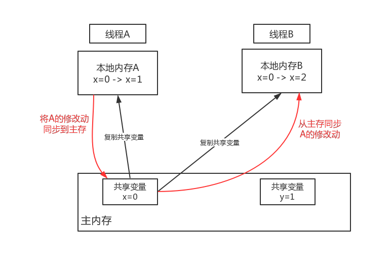

# JMM

Java内存模型（Java Memory Model ）

定义了线程和主内存抽象关系

## 内存工作原理引出的问题

每个线程从主内存读取共享变量，并在自己的本地内存中存储为副本。



<span style="color:red">**A、B 和主内存的如何同步引出问题：** </span>

- 可见性
- 原子性
- 有序性

并发场景可见性、原子性、有序性问题：Runnable、Thread

（可以类比前端ajax异步通信进行理解：```sync:false``` 、```success:callback(response)```）

## 并发问题核心：

1. 解决线程间通信问题
   1. 共享内存 - 隐式
   2. 消息传递 - 显式
2. 解决线程间同步问题
   1. 在共享内存的并发模型中，同步是显式完成的；synchronized同步执行
   2. 在消息传递的并发模型中，由于消息的发送必须在消息接收之前，所以同步是隐式的


## 定位内存可见性问题

什么对象是内存共享的，什么不是

### volatile用法

```java
volatile int x = 0;
```

volatile保证内存可见性：

1. 被修饰的变量x进行写（本地内存A）操作时，JVM发送指令通知处理器lock主内存中变量，

在进行**本地内存**的写操作时，会把这个变量所在缓存行(本地内存)的数据写回到系统内存（主内存）

2. 在多处理器情况下，保证各个处理器缓存一致性特点，就会实现缓存一致性协议

- 原子性
- 可见性
- 不能做到复合操作原子性
- 比synchronized开销小

### synchronized用法

```java
synchronized void add(int x){
    x = 1;
}
```

可重入性，互斥性，可见性


