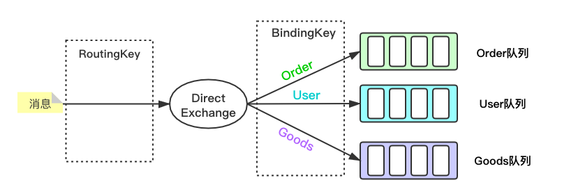
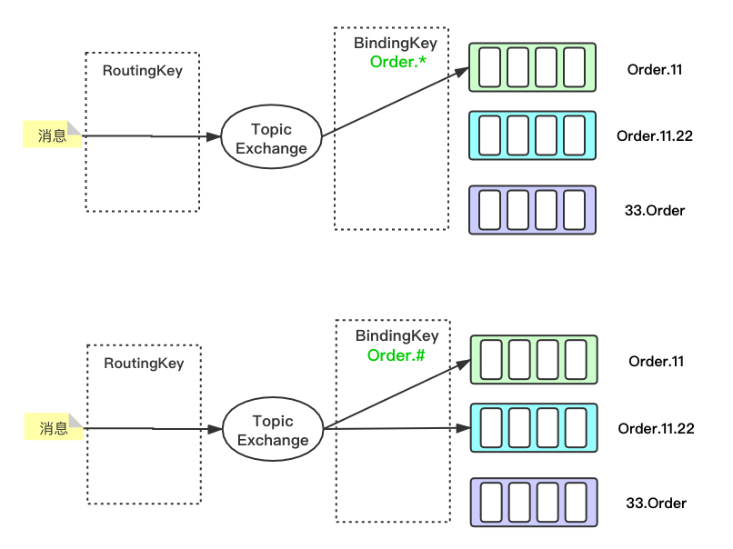

# RabbitMQ高级用法
前面已经讲了如何在不同环境下集成rabbitMQ。这节基于springboot讲一下rabbitMQ中常见的高级用法，主要内容如下：
- 交换机类型
- 消息存活时间
- 死信交换机/死信队列
- 延时队列

## 交换机类型

**Direct（直连交换机）**
交换机通过binding Key将消息精确投递至指定名称的队列



**Topic（主题交换机）**
交换机通过两种通配符（* #）将消息投递至与bindingKey匹配的队列。

【 **.** 】用来分割多个词，"词"可以是不含特殊字符的任意字符串

【*】 匹配一个词

【#】 匹配0或多个词



**Fanout（广播交换机）**

队列与该交换机绑定时，无需指定binding key，该交换机收到的消息将发送给所有与之绑定的队列。

**Headers**

该类型交换机性能很差，很少使用，不多做介绍。

## 消息存活时间 Time To Live（TTL）

设置消息TTL有两种方式：

- 设置队列TTL，发送至该队列的消息超过TTL时间无人消费会被删除
- 单独设置消息TTL

如果同时设置了队列和消息的TTL 则时间短的生效（同时生效，时间短的先执行）

```java
@Bean("ttlQueue")
public Queue queue() {
  Map<String, Object> msgConfig = new HashMap<String, Object>();
  // 设置队列TTL，该队列中的消息10s内未被消费，则会删除
  msgConfig.put("x-message-ttl", 10000);
  return new Queue("TTL_QUEUE", true, false, false, msgConfig);
}


//指定消息的TTL
@Autowired
private AmqpTemplate amqpTemplate;
public void sendMqMsg() {
  MessageProperties messageProperties = new MessageProperties();
  // 消息的过期时间，单位ms
  messageProperties.setExpiration("5000"); 
  Message ttlMsg = new Message("这条消息5s后自动删除".getBytes(), messageProperties);
  amqpTemplate.send("TTL_EXCHANGE", "ttl.routingkey", ttlMsg);
}
```


## 死信队列

消息无法正常投递/消费则会进入死信队列，进入死信队列有如下几个场景：

- 消息被消费者拒绝或未收到消费响应(ack)，且未重新回到队列：(Reject || NotACK  ) && !requeue

- 消息过期(超过TTL时间未消费)
- 消息超过目标队列数限制或消息长度超过队列配置的限制


### 死信队列用法

- 使消息没有消费者而过期。

```java
//交换机
@Bean("someExchange")
public DirectExchange exchange() {
  //这里是direct交换机
  return new DirectExchange("SOME_EXCHANGE", true, false, new HashMap<>());
}

//队列
@Bean("someQueue")
public Queue queue() {
  Map<String, Object> map = new HashMap<String, Object>();
  // 消息5s后成为死信
  map.put("x-message-ttl", 5000);
  // 指定死信交换机，队列中的消息变成死信后，进入死信交换机
  map.put("x-dead-letter-exchange", "DEAD_LETTER_EXCHANGE");

  return new Queue("SOME_EXCHANGE", true, false, false, map);
}

//队列绑定至交换机
@Bean
public Binding binding(@Qualifier("someQueue") Queue queue,
                       @Qualifier("someExchange") DirectExchange exchange) {
  //没有消费者的消息
  return BindingBuilder.bind(queue).to(exchange).with("noConsumer.routingKey");
}
```

- 直接声明死信队列和死信交换机，并绑定

```java
@Bean("deadLetterExchange")
public TopicExchange deadLetterExchange() {
  //这里是topic交换机
  return new TopicExchange("DEAD_LETTER_EXCHANGE", true, false, new HashMap<>());
}

@Bean("deadLetterQueue")
public Queue deadLetterQueue() {
  return new Queue("DEAD_LETTER_QUEUE", true, false, false, new HashMap<>());
}

@Bean
public Binding bindingDead(@Qualifier("deadLetterQueue") Queue queue,
                           @Qualifier("deadLetterExchange")TopicExchange exchange) {
  // 无条件路由
  return BindingBuilder.bind(queue).to(exchange).with("#"); 
}
```

这样消息就进入了死信队列，后续业务直接从死信队列取消息，处理“死信情况下的业务”即可


## 延时队列

RabbitMQ并未直接提供延时队列功能，基于TTL 和死信队列的特点，rabbitMQ常被设计用作延时队列。即，处理一些“到特定时间执行”的业务。

常见的例子如：

- 订单超时未支付自动取消
- 淘宝发货后15天自动确认
- 定时任务，到指定时间启动
- 其它定时/延时执行的业务... ...


对于定时任务场景，常见做法如下：

- 开线程不停扫描数据库或缓存，监听数据状态，发现数据改变时处理特定业务。
- 通过消息TTL使得消息超时，进入死信队列，再监听死信队列进行处理
- 利用rabbitmq-delayed-message-exchange 插件实现


这里主要讲一下TTL+DLX的延时队列，该方式实现死信队列有如下缺点：

- 定的时间不会很准时，存在延迟执行
- TTL只能对队列/消息进行设置，如果时间梯度多（每个业务具有不同的时间要求），设置太多消息的TTL，则可能导致消息阻塞；设置队列TTL，则需要创建很多队列(和交换机) ; 


