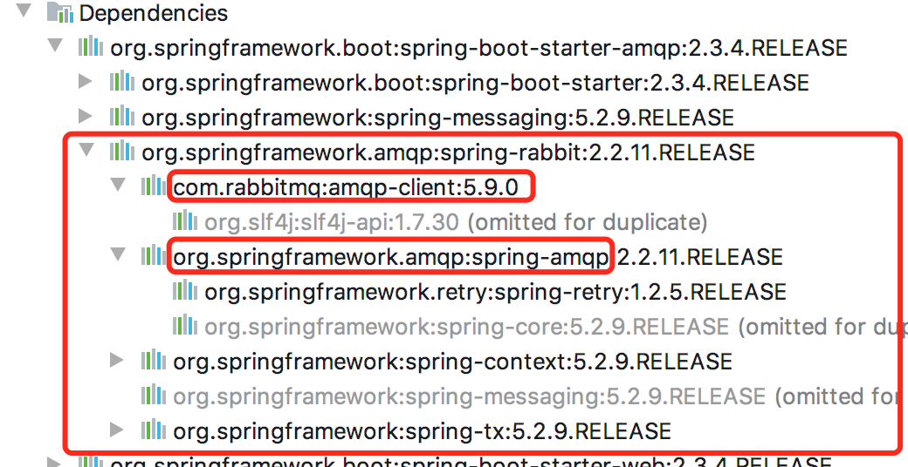
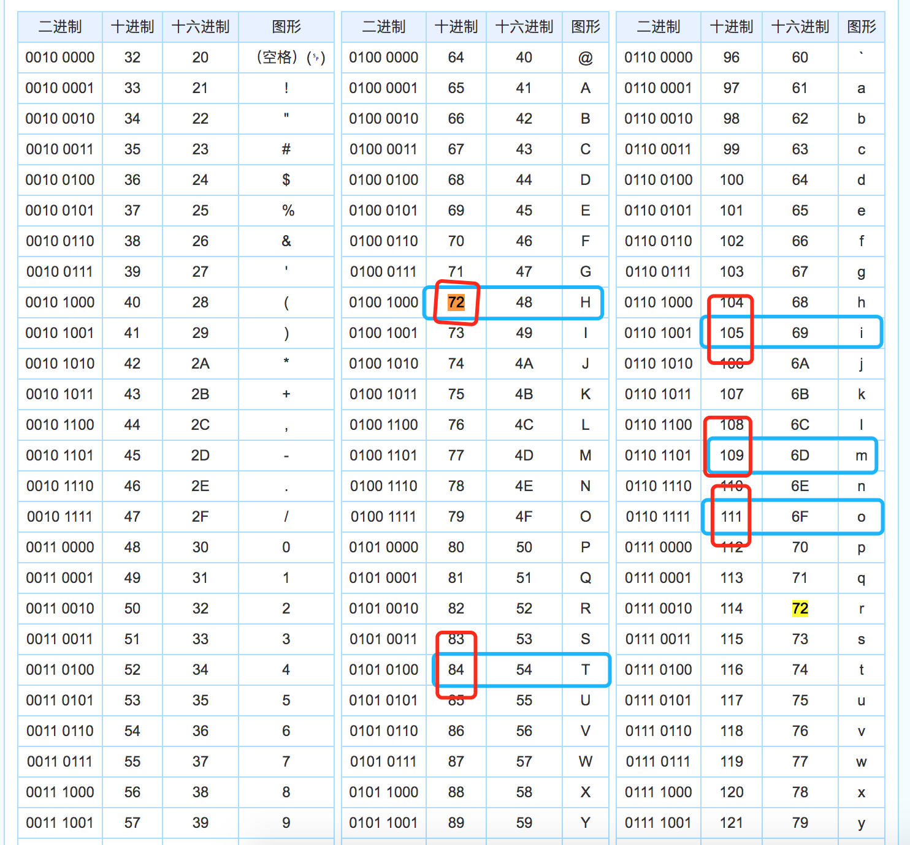

# SpringAmqp
本节主要介绍spring amqp的使用及常见api的封装

## 前言

说到spring amqp 先看下spring amqp的依赖



可以发现，排除了context 和tx事务包以外，主要有client 和 amqp与rabbit mq相关。

其实amqp应该先讲，这样大家就会了解rabbitMQ的协议，了解mq的诞生和发展。

而我这里放在这么多节之后来讲，是防止在刚开始讲一些枯燥概念导致大家云里雾里效果不好。


现在我们有了前面几节的铺垫，大家对rabbitMQ api的基本使用，spring的集成 spring boot的集成 有了大致印象，虽然可能还是没有特别理解，不过这时候再讲amqp协议，大家不会“一脸懵逼”了。


## AMQP协议

引用`RabbitMQ实战指南`的介绍

> AMQP 协议本身包括三层。
>
> - Module Layer: 位于协议最高层，主要定义了一些供客户端调用的命令，客户端可以利用这些命令实现自己的业务逻辑。例如，客户端可以使用Queue . Declare 命令声明一个队列或者使用Basic.Consume 订阅消费一个队列中的消息。
>
> - Session Layer: 位于中间层，主要负责将客户端的命令发送给服务器，再将服务端的应答返回给客户端，主要为客户端与服务器之间的通信提供可靠性同步机制和错误处理。
>
> - Transport Layer: 位于最底层，主要传输二进制数据流，提供帧的处理、信道复用、错误检测和数据表示等。
>
> AMQP 说到底还是一个通信协议，通信协议都会涉及报文交互，从low-level 举例来说，AMQP 本身是应用层的协议，其填充于TCP 协议层的数据部分。而从high-level 来说， AMQP是通过协议命令进行交互的。AMQP 协议可以看作一系列结构化命令的集合，这里的命令代表一种操作，类似于HTTP 中的方法(GET 、POST 、PUT 、DELETE 等) 。

rabbitMQ 不仅支持AMQP协议，还支持STOMP 和 MQTT协议(这个在一些面试中，面试官考知识面广度可能会提到作为加分项)

说到这里还是很抽象，但是提到 `交换器、交换器类型、队列、绑定、路由键`这些前面demo中提到的概念，大家应该不陌生了，这些概念就是AMQP中的概念，也是大佬们为了优化消息通信过程而提出的一些模型概念。

AMQP的主要模型架构就是

> 生产者将消息发送给交换器，交换器和队列绑定。当生产者发送消息时所携带的RoutingKey 与绑定时的BindingKey 相匹配时，消息即被存入相应的队列之中。消费者可以订阅相应的队列来获取消息。

这样，大家对AMQP应该就有点“感觉”了吧。

这里再给大家搬运几个AMQP解释的比较通俗易懂的链接，感兴趣的可以深入了解，不感兴趣的直接跳过。

CRUD程序员只要会api就行[手动狗头]:

官网：https://www.rabbitmq.com/tutorials/amqp-concepts.html

直译：https://www.cnblogs.com/xiaochengzi/p/6895126.html

大佬的深入解读：http://www.blogjava.net/qbna350816/archive/2016/08/12/431554.html


总结一句话：AMQP就是一个协议，是大佬们总结的一种编程模型概念的抽象，约定了通信过程和步骤。用来约束不同MQ中间件厂商，使得大家在使用不同的MQ中间件时，不会出现太大的不兼容情况。

而spring就是对这个协议做了简化封装，方便我们使用。


## Spring AMQP 核心

### 1. ConnectionFactory

从字面理解，它是一个用于创建连接的工厂类

### 2. RabbitAdmin

从字面理解，它是rabbitMQ的管理类，主要提供了交换机&队列的声明/绑定/删除功能等，也可以设置一些交换机/队列的初始化参数，如前面提到的的消息有有效期TTL（Time To Live）

### 3. Message

该类是spring 对消息的一个封装，核心是body 和messageProperties。body就是消息序列化后的字节数组，messageProperties就是消息的一些属性，如:消息的有效期 编码类型等

### 4. RabbitTemplate

该类是spring封装的rabbitMQ操作类，用来简化收发，有点类似于jdbcTemplate(方便大家快速编写jdbc代码，而不需要关注驱动加载，statement result等)。常用它来`创建连接->创建消息信道->收发消息->消息格式转换->关闭信道->关闭连接`等等操作。该类可以通过配置实例化多个，实现对不同连接相互独立的操作。

其中核心又包含ReturnCallBack和ConfirmCallBack。

#### ConfirmCallBack

该功能用于设置消息确认操作，待消费者消费消息之后，告诉发送者`"我已消费消息"`。

```java
rabbitTemplate.setConfirmCallback(new RabbitTemplate.ConfirmCallback(){
    public void confirm(CorrelationData correlationData, boolean ack, String cause) {
        if (ack) {
            System.out.println("消息确认成功");
        } else {
            // nack
            System.out.println("消息确认失败");
        }

    }
});
```


#### ReturnCallBack

该功能用于设置消息确认响应时的一些参数。

```java
@Bean
public RabbitTemplate rabbitTemplate(ConnectionFactory connectionFactory) {
    RabbitTemplate rabbitTemplate = new RabbitTemplate(connectionFactory);
    rabbitTemplate.setMandatory(true);
    rabbitTemplate.setReturnCallback(new RabbitTemplate.ReturnCallback(){
        public void returnedMessage(Message message,
                                    int replyCode,
                                    String replyText,
                                    String exchange,
                                    String routingKey){
        }
    });
    return rabbitTemplate;
}
```


### 5. MessageListener

从字面理解，它是一个需要常开运行的监听者。主要用来监听队列动态，用于处理生产者发送来的消息，并通知/调用消费者进行处理。这个listener主要通过`MessageListenerContainer`来进行管理。

MessageListenerContainer

该Container 可以管理Listener 的生命周期，可以对消费者和队列进行动态配置：动态添加移除队列、设置消费者的ConsumerTag、Arguments、并发、消费者数量、消息确认模式等等。

该container是单例的，且是线程安全的。而它生产/管理的的Listener是可以多个线程各不相同的。

```java
@Bean
public SimpleMessageListenerContainer messageContainer(ConnectionFactory connectionFactory) {
      SimpleMessageListenerContainer container = 
        new SimpleMessageListenerContainer(connectionFactory);
      container.setQueues(getSecondQueue(), getThirdQueue()); //监听的队列
      container.setConcurrentConsumers(1); // 最小消费者数
      container.setMaxConcurrentConsumers(5); // 最大的消费者数量
      container.setDefaultRequeueRejected(false); //是否重回队列
      container.setAcknowledgeMode(AcknowledgeMode.AUTO); //签收模式
      container.setExposeListenerChannel(true);
      container.setConsumerTagStrategy(new ConsumerTagStrategy() { //消费端的标签策略
        @Override
        public String createConsumerTag(String queue) {
          return queue + "_" + UUID.randomUUID().toString();
        }
      });
      return container;
}
```


### 6. MessageConvertor

从字面理解，该接口是定义一个转换类。因为消息传输都是序列化的字节数组，而收到消息时肯定要还原为业务代码可以直接处理的文本消息。这里的字节数组(byte[]) 就是上面提到的message对象的body部分。

整体来说，消息的传输分为两个阶段，序列化和反序列化。

序列化就是把类似 `"Hi Tom"` 这样的文字消息,对照ASCII表(或其它字符集编码表)变为字节数组的过程。

> 如下图 "Hi Tom"，5个字母在ASCII表中分别为十进制的`72 105 84 111 109`，空白符是`32`我没有圈出来
>
> 
>
> 
> 
> 这样一串文字就变成了一串数字，一串数字又可以用二进制表示，在传输过程中直接传输这些文字的二进制，其中每8位二进制作为一个字节，所以就有了上面说的字节数组了。

反序列化就是把上面的字节数组再变回`"Hi Tom"`这个过程。

spring中自带了默认的转换器`SimpleMessageConverter`。

rabbitMQ自带`Jackson2JsonMessageConverter`支持将对象转换为json。

我们也可以通过实现`MessageConverter`接口，并重写`toMessage()`和`fromMessage()`方法来实现消息的序列化(toMessage)和反序列化(fromMessage)。


## 结束语

至此spring的基础接口就讲完了。

demo源码可以在https://github.com/teartao/rabbitmq-samples.git 的chapter-05找到。


参考文献：
[1] RabbitMQ官网：https://www.rabbitmq.com/
[2] RabbitMQ实战指南 朱忠华

